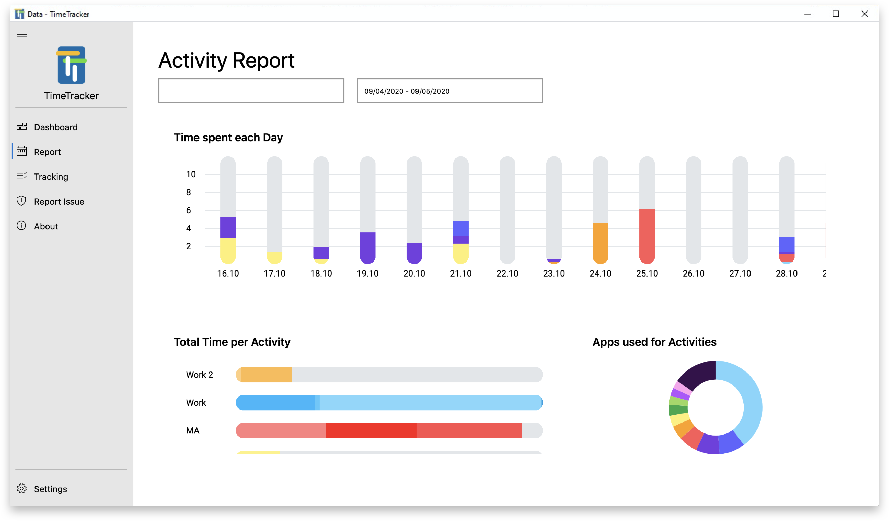

<h1 align="center">
    </img>
   
  TimeTracker
   
</h1>

<h4 align="center">An offline program to keep track of what you worked on</h4>
<h4 align="center">Download <a href="https://github.com/RobinWeitzel/WindowsTimeTracker/releases/download/1.0.0.0/TimeTrackerSetup.msi">here</a> </h4>

* Smart + manual activity tracking
* No input needed 99% of the time
* Different visualizations and analytics
* Offline & Open source -> Your data is secure on your own machine
* No admin rights needed

## Impressions

#### Your day, at a glance

#### Your activities in detail - last week, last month, last year 

## How To Use

Run the installer found in the download section.
Follow the tutorial, then type your first activity in the dialog on the bottom right.

## Download

You can download the latest version of TimeTracker [here](https://github.com/RobinWeitzel/WindowsTimeTracker/releases/download/1.0.0.0/TimeTrackerSetup.msi).

## Credits

This software uses the following open source packages:

- [CsvHelper](https://github.com/JoshClose/CsvHelper)
- [CefSharp](https://github.com/cefsharp/CefSharp)

## License

Apache 2.0
